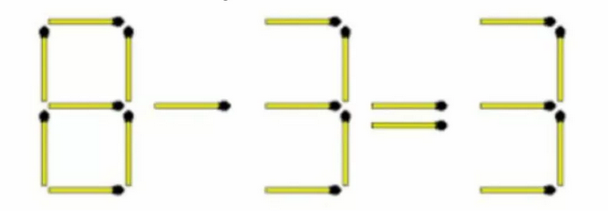
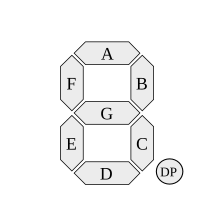

# Matchstick Bruteforcer

## Description
A C++ app to solve simple "Move one matchstick to solve the equation" problems by bruteforcing all possible movement combinations.

Currently the app assumes "=" sign in the equation is immutable, meaning no match can be taken from "=" sign.


## Usage

Modify `main()` function according to the equation you're trying to solve.

Let's assume you're trying to solve the following equation:



Then your `main()` should look like that:

```cpp
int main()
{

    Equation a;
    a.numberToDigit(8, a.num1);
    a.numberToDigit(3, a.num2);
    a.numberToDigit(3, a.solution);
    a.sign = false; //false if the sign between operands is a minus, true otherwise
    a.solve();
}
```

And here's the result:

```
8 - 5 = 3
Changed second number with the second number
1 => 6
```

Meaning that resulting equation is `8 - 5 = 3`, achieved by changing a second operand by moving matchstick from position 1 to position 6.

Here's a photo that shows how positions of are represented:



Consider that A=0, B=1... etc.

## Limitations

- Currently the program has to be recompiled everytime you change the equation. 
- The program doesn't try to move any match from "=" sign (meaning it is immutable).
- Curently only one match movement is supported (if there's a task like "move 2 matches to solve equation" it won't work).
